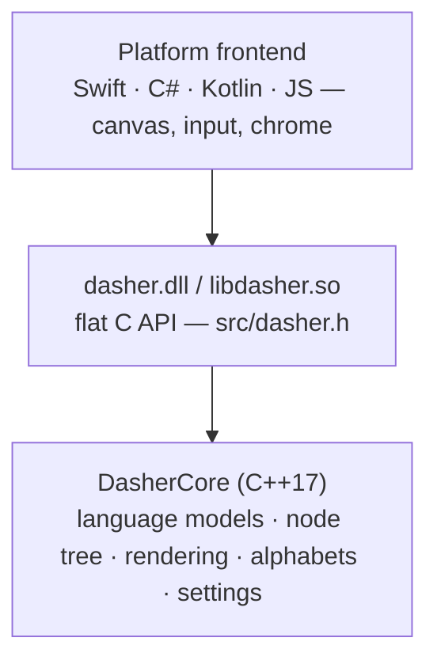

# DasherCore

[](https://github.com/dasher-project/DasherCore/actions/workflows/ci.yml)
[](https://github.com/dasher-project/DasherCore/releases)
[](./LICENSE)

Dasher is an information-efficient text-entry interface, driven by continuous pointing gestures. It lets you write using eye gaze, a mouse, a switch, a joystick, or touch — designed for accessibility and augmentative communication (AAC).

**DasherCore** is the platform-independent C++ engine behind every Dasher frontend — language modelling, the zooming node tree, rendering, alphabets, and settings. It's exposed through a flat C API (the recommended integration path), and frontends ([Apple](https://github.com/dasher-project/Dasher-Apple) · [Windows](https://github.com/dasher-project/Dasher-Windows) · [GTK](https://github.com/dasher-project/Dasher-GTK) · [Android](https://github.com/dasher-project/Dasher-Android) · [Web](https://github.com/dasher-project/dasher-web)) typically link it as `dasher.dll` / `libdasher.so` and provide only input and a canvas.

> **[dasher.at](https://dasher.at)** — downloads, user docs, live demo
> **[Feature status](https://dasher.at/status/)** — what each platform supports
> **[All repos](https://github.com/dasher-project)** — engine, frontends, governance

## Status

> **Beta (v6).** One shared engine, several native frontends in active development. See the [feature matrix](https://dasher.at/status/) for what's implemented per platform.

## Build

### Prerequisites

- CMake 3.12+
- A C++17 compiler (MSVC, GCC, or Clang)
- Git (the build pulls in `Thirdparty/pugixml` as a submodule)
- Python 3.6+ — optional, only for regenerating `Parameters.cpp` from `settings_manifest.json`

### Quick build

```bash
git clone --recurse-submodules https://github.com/dasher-project/DasherCore.git
cd DasherCore
cmake -B build -DCMAKE_BUILD_TYPE=Release
cmake --build build
```

Outputs:

- `build/bin/dasher.dll` (or `.so` / `.dylib`) — the C API shared library
- `DasherCore` static library target — the engine itself

| CMake option | Default | Effect |
| --- | --- | --- |
| `BUILD_CAPI` | `ON` | Build the C API shared library (`dasher.dll` / `libdasher.so`) |
| `BUILD_TESTS` | `ON` | Build the test executables (doctest) |
| `DASHER_SANITIZE` | `OFF` | Enable AddressSanitizer + UBSan (Debug) |
| `DASHER_ENABLE_CLANG_TIDY` | `OFF` | Run clang-tidy during the build |

### Parameter code generation

Parameter metadata lives in one source of truth — `settings_manifest.json` — and codegen emits `src/DasherCore/Parameters.cpp`. The `Parameters.h` enum is hand-maintained. When Python is present, CMake regenerates `Parameters.cpp` automatically when the manifest changes; without Python, the committed file is used as-is. To regenerate manually: `python3 Scripts/generate_parameters.py`. See `settings_manifest.json` for the full schema.

## C API

The C API is the **recommended** way to consume DasherCore — it keeps the engine free to evolve and frontends free of C++ build complexity, and it's what the v6 frontends target. It's not mandatory: before v6, frontends linked the C++ engine directly, and you're still free to do that (build `DasherCore` as a static library and subclass `CDasherScreen` / `CDasherInput` in C++). Use whatever fits your platform; just note that the C API is where the boundary discipline (and our attention) is focused.

The contract is a single header — **[`docs/C_API.md`](./docs/C_API.md)** is the authoritative reference (lifecycle, input, draw commands, parameters, callbacks, localization, Swift/Kotlin integration). The essentials:

```c
#include "dasher.h"

dasher_ctx* ctx = dasher_create("/path/to/DasherCore/Data", NULL, NULL);
dasher_set_screen_size(ctx, 800, 600);

while (running) {
    dasher_mouse_move(ctx, mouse_x, mouse_y);

    int* cmds; int cmd_count;
    char** strs; int str_count;
    dasher_frame(ctx, timestamp_ms, &cmds, &cmd_count, &strs, &str_count);

    // render cmds/strs with your canvas — see docs/C_API.md for the opcode table
}

dasher_destroy(ctx);
```

A `dasher_ctx` is **not thread-safe** — one thread per context. `dasher_frame()`, `dasher_mouse_*()`, and `dasher_key_event()` catch C++ exceptions at the boundary and latch an engine-fault flag (query with `dasher_has_engine_error()`); on fault, destroy and recreate the context. See `docs/C_API.md` and RFC 0009 Amendment 2.

## Architecture



For the engine internals (component map, frame loop, node tree, settings), see **[`docs/ARCHITECTURE.md`](./docs/ARCHITECTURE.md)**. For pluggable language models see [`docs/LM_REGISTRY.md`](./docs/LM_REGISTRY.md); for in-canvas control nodes see [`docs/CUSTOM_ACTIONS.md`](./docs/CUSTOM_ACTIONS.md).

## Repository layout

| Path | Purpose |
| --- | --- |
| `src/dasher.h` | Public C API header |
| `src/CAPI.cpp` | C API implementation (incl. `CommandScreen`, `PointerInput`) |
| `src/DasherCore/` | The engine: models, views, input filters, language models |
| `Data/` | Alphabets, colour palettes, training corpora (bundled by frontends) |
| `Strings/` | Localizable string tables (`strings_<locale>.json`) |
| `Scripts/` | Codegen + data-generation (`generate_parameters.py`, `extract_strings.py`, `generate_training.py`) |
| `tests/` | doctest suites (one executable per file) |
| `docs/` | C API, architecture, language-model registry, custom actions |

## Localization

All translatable strings live in `settings_manifest.json`; the engine returns them via `dasher_get_parameter_info()`. At runtime, frontends call `dasher_set_locale(ctx, "de")` to load `Strings/strings_de.json` (falling back to English). To extract the template for translators: `python3 Scripts/extract_strings.py` → `Strings/strings_en.json`. API details in [`docs/C_API.md`](./docs/C_API.md).

## Data sources

Training corpora in `Data/training/` are generated from the **KeithAAC multilingual AAC datasets** by Keith Vertanen:

> *Multilingual Text For Augmentative And Alternative Communication (AAC)* — https://osf.io/bnfdv — NSF Grant No. 1750193. COMM2, Turk, Imagine: CC BY 4.0; DailyDialog: CC BY-NC-SA 4.0.

Alphabet files in `Data/alphabets/autoConverted/` are generated from the [WorldAlphabets](https://github.com/aactools/worldalphabets) project (character sets, layouts, and frequency data for 344 languages). Both are regenerated via `Scripts/generate_training.py`.

## Credits

> *In memory of **David J. C. MacKay** (1967–2016), who invented Dasher and led the Inference Group that built it.*

Dasher was created at the **Inference Group, Cavendish Laboratory, University of Cambridge**, and this codebase carries 25 years of contributions from **over 400 authors**. Particular credit to:

- **The Cambridge Inference Group** — David MacKay, Phil Cowans, Alan Lawrence, David Ward, Patrick Welche, and Keith Vertanen, who designed and built the original engine and language models.
- **The wider free-software community** — including Matthew Garrett, Chris Ball, and the many GNOME translators; the original GPL version is still maintained separately at [GNOME GitLab](https://gitlab.gnome.org/GNOME/dasher).
- **The v6 / DasherCore effort** — Sebastian Pape, who did the heavy lifting to reshape Dasher into a reusable, API-driven engine; Gavin Henderson and Will Wade; with [Ace Centre](https://acecentre.org.uk/) stewarding the project.

The full roster lives in the [contributors graph](https://github.com/dasher-project/DasherCore/graphs/contributors); the current maintainer set is in [`.github/CODEOWNERS`](./.github/CODEOWNERS). Dasher is a community project — see the [governance repo](https://github.com/dasher-project/governance) for how decisions get made.

## License

MIT — see [LICENSE](./LICENSE). Dasher was originally GPL, developed by the Inference Group; this fork was re-licensed to MIT (stewarded by Ace Centre, with legal guidance from the FSFE) after securing permission from the contributors whose code remains. The full story is in [LICENSE_NOTES.md](./LICENSE_NOTES.md). The original GPL version is still maintained at [GNOME GitLab](https://gitlab.gnome.org/GNOME/dasher).

## Contributing

See [CONTRIBUTING.md](./CONTRIBUTING.md) for build detail, the C-API boundary rules, code style, and DCO sign-off. For project-wide conventions (code of conduct, RFCs, security), see the [org contributing guide](https://github.com/dasher-project/.github/blob/main/CONTRIBUTING.md). Substantial changes start as an RFC in [`governance/rfcs`](https://github.com/dasher-project/governance/tree/main/rfcs).
